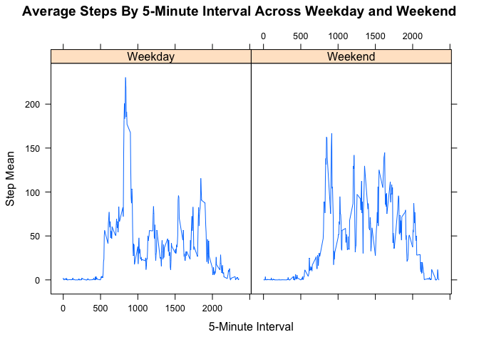

# Reproducible Research: Peer Assessment 1

## Loading and preprocessing the data

```r
sourceUrl       <- "https://d396qusza40orc.cloudfront.net/repdata%2Fdata%2Factivity.zip"
targetDirectory <- "reproducibleResearchProject1Data" 
targetPath      <- paste(targetDirectory, "/activity.zip", sep="") 
sourcePath      <- paste(targetDirectory, "/activity.csv", sep="") 
    
if (!file.exists(targetPath))
{
    if (!file.exists(targetDirectory))
    {
        dir.create(targetDirectory)
    }
        
    download.file(sourceUrl, dest=targetPath, method="curl")
    unzip(targetPath, exdir=targetDirectory)
    timestampPath <- paste(targetDirectory, "/downloadTimestamp.txt", sep="")    
    write(format(Sys.time(), "%c"), file=timestampPath)
}
activity <- read.csv(sourcePath)
str(activity)
```

```
## 'data.frame':	17568 obs. of  3 variables:
##  $ steps   : int  NA NA NA NA NA NA NA NA NA NA ...
##  $ date    : Factor w/ 61 levels "2012-10-01","2012-10-02",..: 1 1 1 1 1 1 1 1 1 1 ...
##  $ interval: int  0 5 10 15 20 25 30 35 40 45 ...
```

## What is mean total number of steps taken per day?

```r
# Sum steps by day 
daily <- aggregate(steps ~ date, data=activity, sum, rm.na=TRUE)

# Make a histogram of the total number of steps taken each day using the as recoreded data
hist(daily$steps, main="As Recorded - Total Number Of Steps Taken Each Day", xlab="As Recorded Steps")
```

 

```r
# Compute daily mean and median steps
meanDailySteps   <- round(mean(daily$steps))
medianDailySteps <- median(daily$steps)
```
Using the as recorded data, the mean number of steps taken per day is 10767 and the median steps taken per day is 10766. 

## What is the average daily activity pattern?

```r
# Compute mean of steps by 5-minute interval
intervalMeans <- aggregate(steps ~ interval, data=activity, mean, rm.na=TRUE)

# Make a time series plot of the 5-minute interval (x-axis) and the average number of steps taken, averaged across all days (y-axis)
plot(steps ~ interval, 
     intervalMeans, 
     type = "l",
     main="As Recorded - Mean of Steps Taken By 5-Minute Interval", 
     xlab="5-Minute Interval",
     ylab="Step Mean")
```

 

```r
# Locate the 5-minute interval that contains the maximum number of steps
maxAverageStepInterval <- intervalMeans[which.max(intervalMeans$steps), "interval"]
```
Using the as recorded data, on average the 5-minute interval that contains the maximum number of steps is 835.

## Imputing missing values

```r
# Determine which columns have missing values
sapply(activity, function(column) sum(!complete.cases(column)))
```

```
##    steps     date interval 
##     2304        0        0
```

```r
# Count rows with missing values
rowsWithMissingValueCount <- sum(!complete.cases(activity))
```

```r
# Create a new dataset that is equal to the original dataset but with the missing data filled in.  
imputedActivity <- merge(activity, intervalMeans, by="interval")
imputedActivity <- within(imputedActivity, imputedSteps <- ifelse(!is.na(steps.x), steps.x, steps.y))
```

```r
# Make a histogram of the total number of steps taken each day
imputedDaily <- aggregate(imputedSteps ~ date, data=imputedActivity, sum)
hist(imputedDaily$imputedSteps, main="Imputed - Total Number Of Steps Taken Each Day", xlab="Steps")
```

 

```r
# Calculate and report the mean and median total number of steps taken per day
imputedMeanDailySteps   <- round(mean(imputedDaily$imputedSteps))
imputedMedianDailySteps <- round(median(imputedDaily$imputedSteps))
```
Do these values differ from the estimates from the first part of the assignment?  
Using the imputed data, the mean number of steps taken per day is 10766 and the median steps taken per day is 10766.  

What is the impact of imputing missing data on the estimates of the total daily number of steps?  
These results are virtually identical to the as recorded mean and median of 10767 and 10766 respectively.

## Are there differences in activity patterns between weekdays and weekends?

```r
# Add weekday factor to imputedActivity frame
imputedActivity$weekday <- factor(weekdays(as.Date(imputedActivity$date), abbr=TRUE) %in% c("Sat", "Sun"), 
                                  levels = c(F, T), 
                                  labels = c("Weekday","Weekend"))

# Compute average steps across weekday / weekend factor
stepMeanByIntervalAcrossWeekday <- aggregate(imputedSteps ~ interval + weekday, data=imputedActivity, mean)

# Make time series panel plot
library(lattice)
xyplot(imputedSteps ~ interval | weekday, 
       type="l", 
       data=stepMeanByIntervalAcrossWeekday,
       main="Average Steps By 5-Minute Interval Across Weekday and Weekend",
       xlab="5-Minute Interval",
       ylab="Step Mean") 
```

 
